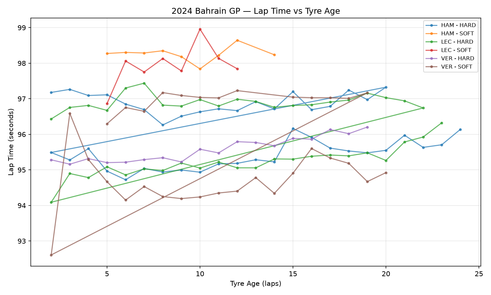

# F1 Race Strategy & Tyre Degradation Analyzer

Analyzing real Formula 1 telemetry data to model tyre degradation and evaluate race strategy decisions — built with Python, SQL, and Power BI.

## Overview

This project pulls official F1 lap-by-lap timing and tyre data (via the [FastF1](https://github.com/theOehrly/Fast-F1) library) and analyzes how tyre performance degrades over a stint. The goal: quantify how much lap time a driver loses per lap of tyre age, by compound, and use that to reason about pit stop strategy — the same core question race strategists solve on the pit wall.

Built as part of a self-directed motorsport data analytics portfolio, combining a data analytics/AI background with a long-standing interest in F1 strategy.

## What it does

- Pulls lap, tyre compound, tyre age, and stint data for any F1 session (2018–present)
- Cleans the data — removes in/out laps and laps run under Safety Car/VSC that would distort degradation numbers
- Calculates a **degradation slope** (seconds lost per additional lap of tyre age) per driver, per compound, per stint
- Plots lap time vs. tyre age to visually compare degradation across drivers and compounds
- Exports clean, structured CSVs ready to load into a SQL database or Power BI

## Sample output



*Lap time vs. tyre age for selected drivers — steeper lines indicate faster tyre degradation.*

## Tech stack

| Layer | Tool |
|---|---|
| Data source | [FastF1](https://github.com/theOehrly/Fast-F1) (official F1 timing API wrapper) |
| Data processing | Python, pandas |
| Visualization | matplotlib |
| Structured storage | SQL (schema included, see `f1_schema.sql`) |
| Dashboard layer | Power BI (via exported CSVs) |

## Project structure

```
f1-race-strategy-analyzer/
├── f1_tyre_degradation_analysis.py   # main analysis script
├── f1_schema.sql                      # relational schema + example queries
├── tyre_degradation.png               # sample output plot
└── README.md
```

## How to run it

**Requirements:** Python 3.9+

```bash
pip install fastf1 pandas matplotlib
python f1_tyre_degradation_analysis.py
```

On first run, it downloads and caches session data (takes 1–2 minutes, needs internet access). Subsequent runs on the same race are near-instant.

To analyze a different Grand Prix, edit the config block at the top of `f1_tyre_degradation_analysis.py`:

```python
YEAR = 2024
GRAND_PRIX = "Singapore"      # any GP name FastF1 supports
SESSION = "R"                  # R = Race, Q = Qualifying, FP1/FP2/FP3
DRIVERS = ["VER", "HAM", "LEC"]  # driver codes to compare
```

## Output files

Running the script generates race-specific output files, so re-running for a different race never overwrites a previous one:
- `tyre_degradation_summary_<race>_<year>.csv` — degradation slope per driver/compound/stint
- `clean_laps_export_<race>_<year>.csv` — cleaned lap-by-lap data, ready for Power BI or SQL import
- `tyre_degradation_<race>_<year>.png` — comparison plot

e.g. running the Singapore 2024 race produces `tyre_degradation_singapore_2024.png`.

## SQL layer

`f1_schema.sql` defines a relational schema (`sessions`, `drivers`, `laps`, `stint_degradation`) for loading the exported CSVs into a proper database, along with example analytical queries — e.g. finding which compound degrades fastest, or comparing two drivers' pace drop-off on the same tyre.

## Roadmap

- [ ] Pit stop strategy simulator (1-stop vs. 2-stop, using track-specific pit loss time)
- [ ] Sector-by-sector telemetry overlay for qualifying lap comparisons
- [ ] Power BI dashboard (season-level pace comparison)

## Author

Thangavel K — B.Tech, Artificial Intelligence & Data Science, Saranathan College of Engineering
[LinkedIn](https://www.linkedin.com/in/thangavel-kbtech) · [GitHub](https://github.com/Dazaicodes02)
